# 🎵 Music Recommender Simulation

## Project Summary

I built a simple music recommender that scores songs against a user's taste profile using four features: genre, mood, energy level, and acousticness. Each feature carries a fixed weight, and the system ranks every song by how closely it matches the user's preferences, then returns the top k results.

---

## How The System Works

Unlike Spotify or YouTube, which uses advanced machine learning techniques that score from various features like clicks, skips, likes, and sound profile before running them through a complex ML pipeline, my recommender takes a simpler approach. It doesn't know anything about what other people like. It only knows the current user, and tries to find songs that match their taste directly.

Each song carries a set of descriptive features like genre, mood, energy level, acousticness, tempo, valence, and danceability. The user profile stores the things that matter most for example, their favorite genre and mood, how energetic they like their music, and whether they tend to prefer acoustic sounds.

When scoring a song, the system compares those profile preferences against the song's features using a simple weighted formula. Genre match matters most (35%), followed by mood (25%), energy (25%), and acousticness (15%). Valence, danceability, and tempo are will be used for future experimentation.

Once every song has a score, the system sorts them highest to lowest and returns the top 5. The final score sits between 0.0 and 1.0, which represents the predicted percentage match for the user preference and the song.

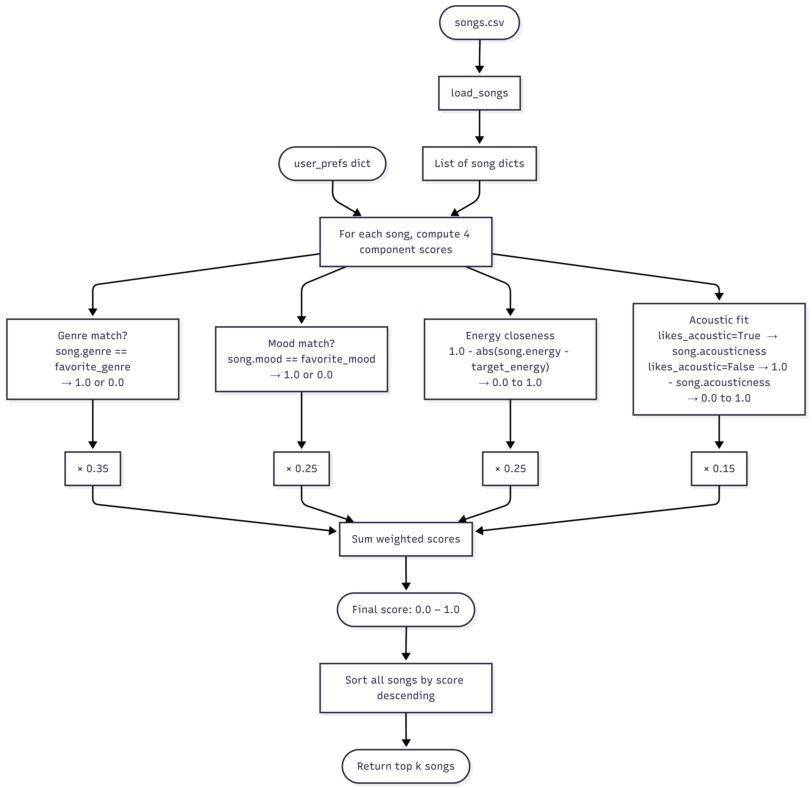

## Known Biases

- Genre has a 35% weighting, so a genre match alone can outscore a song that nails mood, energy, and acousticness but has the wrong genre.
- Genre and mood use exact string comparison, so indie pop ≠ pop scores 0 despite being closely related. There is no concept of genre or mood proximity. I can address this with transformations to the song genre before being fed into the recommender.
- Valence, danceability, and tempo aren't being utilized in the recommender. A deeply sad song and an upbeat one score identically if their other features match, which can produce recommendations that feel tonally wrong. I will experiment with these features if I have the time.

---

## Getting Started

### Setup

1. Create a virtual environment (optional but recommended):

  ```bash
  python -m venv .venv
  source .venv/bin/activate      # Mac or Linux
  .venv\Scripts\activate         # Windows
  ```

2. Install dependencies

```bash
pip install -r requirements.txt
```

3. Run the app:

```
python src/main.py
```

Example Output:

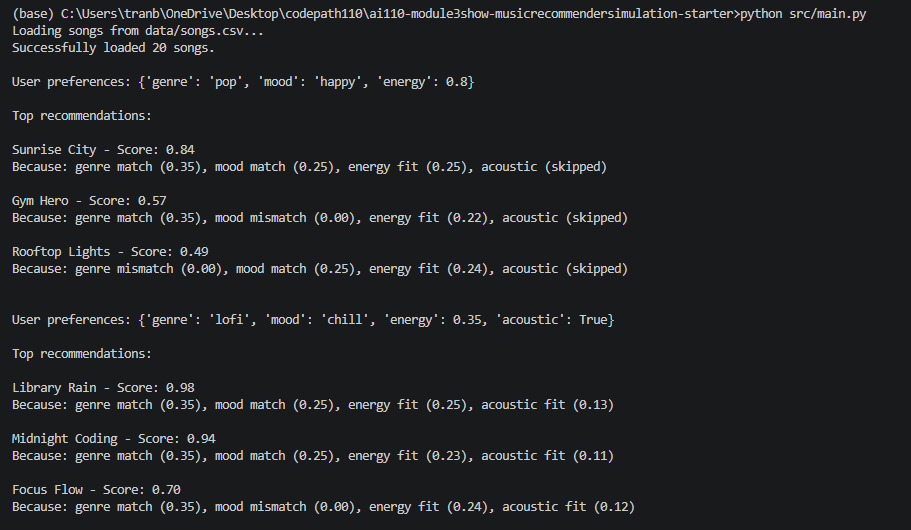

### Running Tests

Run the starter tests with:

```bash
pytest
```

---

## Experiments

I will be testing edge cases and model sensitivity within this section. The first image will be the default model while the second image will be the model with a weight shift from genre dominant to energy dominant.

### Edge Case 1 — Single categorical field

Because Python's sort is stable, tied songs are returned in their original CSV insertion order. The system produces a ranked list with zero real differentiation among the top results. There is no tiebreaker logic, so the winner among equally scored songs is an determined soley by data order, not preference alignment. The lofi profile returns the three lofi songs Midnight Coding, Library Rain, and Focus Flow which are all quiet, low-energy, and instrumental. The remaining two slots fill with whatever comes first in the CSV regardless of fit.

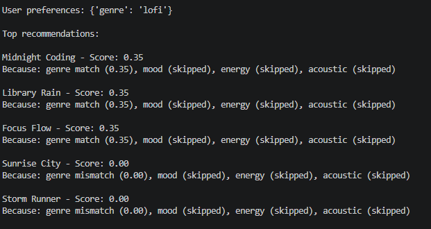

After running a weight shift from genre's .35 to .175 and energy from .25 to .425, the single genre bias remains the same. Since energy is not in this user profile the raised energy weight has nothing to act on, so the same three lofi songs appear at the top with a lower printed score. The composition of results does not change at all, only the numbers do.

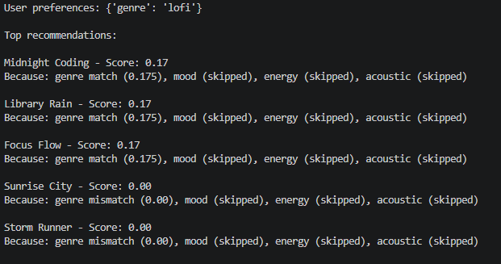

---

### Edge Case 2 — Genre and mood that don't exist

The system returns results, but the compressed score means all songs cluster closely together. Small differences in energy proximity become the primary differentiator, which can surface non-obvious winners (a mid energy synthwave track Night Drive beating a folk track Empty Porch because because intuitively, folk should be closer to bossa nova and zen). This shows how heavily the system depends on categorical hits to produce intuitive results. The default model surfaces Night Drive (synthwave, mid to high energy) and Crown Up (hip-hop, mid to high energy) despite the intent being closer to gentle bossa nova.

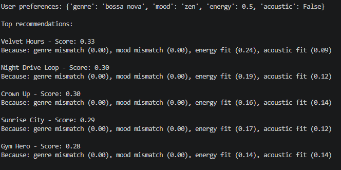

For test case 2  the system still relies on categorical features to drive intuitive results. Another issue came up here which exposes tiebreaker logic again because rankings are sorted purely by insertion order. With energy weighted more heavily, songs closest to 0.5 energy shifts rankings for mid tempo tracks like Velvet Hours (r&b) and Dirt Road Summer (country). The genre is still completely wrong relative to bossa nova, but the energy signal now dominates the full 0.40 of available continuous weight and produces a noticeably different list.

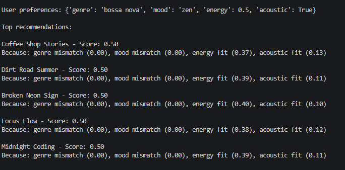

---

### Edge Case 3 — Contradictory / self-fighting profile 

When categorical weights sum to 0.60 the remaining 0.40 of continuous features cannot overcome even at maximum disagreement. A user who genuinely wants quiet acoustic music but states metal/aggressive as their genre/mood will consistently receive recommendations that contradict their continuous preferences. This confirms the over reliance on categorical matching noted in Known Biases. The default model puts Iron Collapse which is a loud, fast, and nearly non-acoustic metal track at the top of the list for a user who asked for energy=0.0 and acoustic=True.

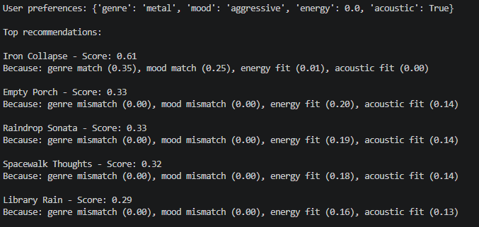

For test case 3, the recommendations look alot more balanced. Iron Collapse was not skewed to the top for having a dominating genre match when presented with low energy and acoustic profile. With genre weight halved and energy weight raised, low energy and highly acoustic songs like Empty Porch (folk) and Raindrop Sonata (classical) now outscore Iron Collapse because they match the continuous preferences.

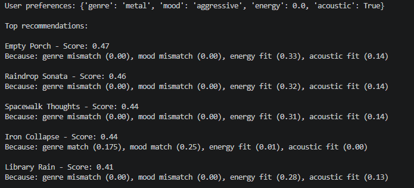

### Refined Model - Genre/Mood Proximity, Valence Tiebreaker, and Soft Acoustic target

I wanted to see how adding feature proximity, tiebreaker logic, soft multipliers would affect the above test cases. First image is the old model and the second image is the refined model.

### Edge Case 1 — Single categorical field


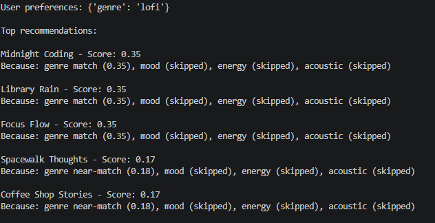

We can see that new songs are now surfaced due to the genre/mood proximity. The near-match songs (ambient, jazz, classical) now score 0.175 and fill out the rest of the top 5 where previously only 3 lofi songs scored above 0. However, since there is no mood in this user profile, valence_direction is set to 0 and the tiebreaker does not fire. The near-match songs are still ordered by CSV insertion.

### Edge Case 2 — Genre and mood that don't exist


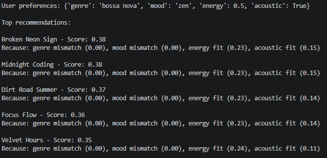

The soft acoustic target paired with valence tiebreaker definitely changed the outputs. But having no genre or mood context won't really give intuitive results still. Worth noting that the tiebreaker was not utilized here  because zen is not in either the high or low valence mood sets, so valence_direction is 0 and any output change is purely from the soft acoustic target.

### Edge Case 3 — Contradictory / self-fighting profile 


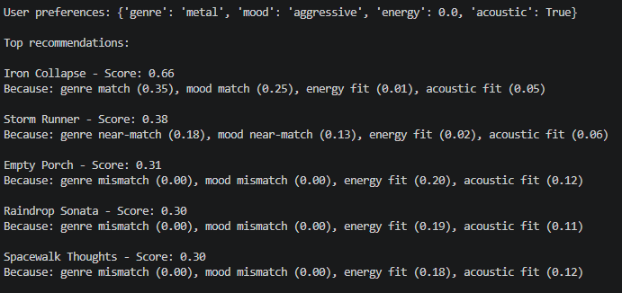

Genre still dominates after refining the model but the results differ. The key shift is that Storm Runner (rock, intense) now enters the top results via proximity 0.175 from rock metal near-match plus 0.125 from intense aggressive near-match gives it 0.30 categorical credit before energy or acoustic are even scored. That is enough to push it into the top 5 despite having near zero energy and acoustic fit. Iron Collapse's total score actually went slightly up rather than down because the soft acoustic target of 0.7 is less punishing for acousticness=0.03.

---

## Limitations and Risks

The recommender operates on a dataset of only 20 songs, which is too small to find meaningful diversity or handle niche preferences. It relies entirely on four weighted features (genre, mood, energy, acousticness) with no learning from actual user behavior, so the weights are fixed guesses rather than data driven signals. Categorical features like genre and mood are binary where a song either matches or it doesn't which means the system cannot reason about song proximity (jazz being closer to blues than to metal). The model also has no tiebreaker logic, so songs with identical scores are ranked by their insertion order in the CSV rather than any preference signal.

---

## Reflection

Building this recommender made me realize that for my version at least is really just a formalized opinion. I decided what features matter, assigned them weights, and that choice shapes the result the system produces. Genre being worth 35% is a design decision and users will never see it or know why. This is the part that stuck with me most because the math looks objective on the surface, but the assumptions are the real drivers for these systems.

The bias was harder to see until I ran the edge cases and exposed these glaring issues. The binary categorical matching means the system has no sense of closeness between genres for example jazz and blues score the same as jazz and metal when neither matches. This can be a disadvantage for users with niche or cross genre tastes. Bias also presents itself with feature dominance in this case genre which overshadows other features like energy and acousticness even if they are a perfect fit. I didn't designed this model with these consequences in mind, more so how I important I felt these features were. In a larger system trained on user behavior, that same problem can show up if certain genres or moods are underrepresented in the training data. The model will learn to underserve those users and nobody will notice.


---


